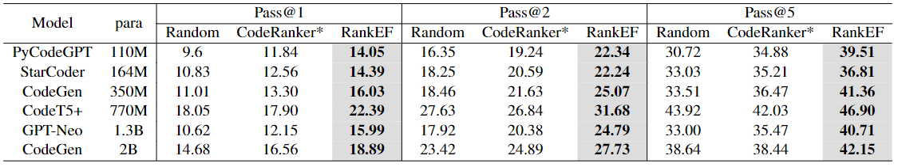

# RankEF_additional

Initially, I conducted experiments on some models after removing the static erroneous code. However, due to limited space and the pressing submission deadline, we did not have extra time to perform this experiment on all models and lacked the space to include it. We will add these experimental results in the revised version.
